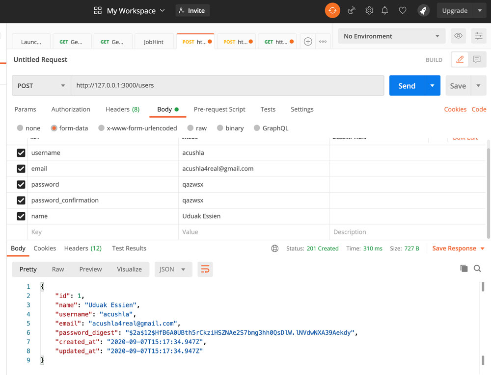
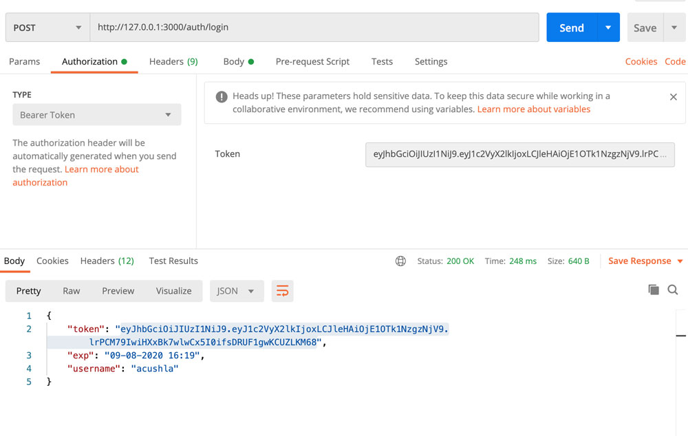
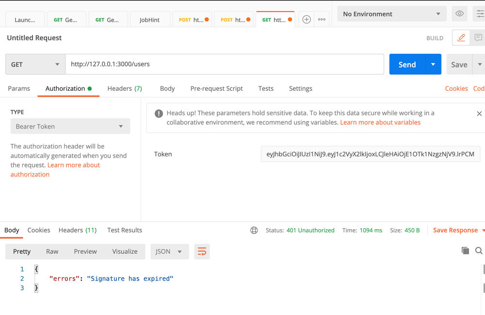

# Rails API Only Application

This is a simple project used to practice a Rails API only application with JWT token.

Below are images to demonstrate the API basic usage with Postman

## Create New User

## Login a User

## Get user with invalid token

